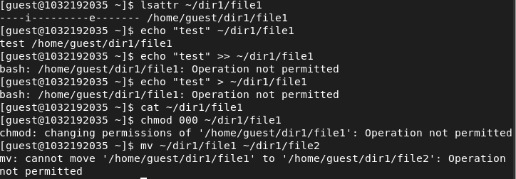

---
## Front matter
lang: ru-RU
title: Дискреционное разграничение прав в Linux. Расширенные атрибуты
subtitle:
author:
  - Соболев М. С.
institute:
  - Российский университет дружбы народов, Москва, Россия
date: 30 сентября 2022

## i18n babel
babel-lang: russian
babel-otherlangs: english

## Formatting pdf
toc: false
toc-title: Содержание
slide_level: 2
aspectratio: 169
section-titles: true
theme: metropolis
header-includes:
 - \metroset{progressbar=frametitle,sectionpage=progressbar,numbering=fraction}
 - '\makeatletter'
 - '\beamer@ignorenonframefalse'
 - '\makeatother'

## Fonts
mainfont: PT Serif
romanfont: PT Serif
sansfont: PT Sans
monofont: PT Mono
mainfontoptions: Ligatures=TeX
romanfontoptions: Ligatures=TeX
sansfontoptions: Ligatures=TeX,Scale=MatchLowercase
monofontoptions: Scale=MatchLowercase

---

# Информация

## Докладчик

:::::::::::::: {.columns align=center}
::: {.column width="70%"}

  * Соболев Максим Сергеевич
  * Студент 4 курса, 1032192035
  * Направление: Бизнес-информатика
  * Российский университет дружбы народов
  * [sobolek322lorek@gmail.com](sobolek322lorek@gmail.com)

:::
::: {.column width="30%"}

:::
::::::::::::::

# Вводная часть

## Актуальность

- Продолжаем изучать дискреционное разграничение прав в Linux.

## Объект и предмет исследования

- Объектом исследования являются: расширенные атрибуты
- Закрепление теоретических основ

## Цель

- Получение практических навыков работы в консоли с расширенными атрибутами файлов

## Материал

- Отчет по ранее выполненной работе

# Выполнение работы

## 1

От имени пользователя guest определяем расширенные атрибуты файла /home/guest/dir1/file1 командой lsattr /home/guest/dir1/file1

{ #fig:001 width=70% }

## 2

Устанавливаем командой chmod 600 file1 на файл file1 права, разрешающие чтение и запись для владельца файла

{ #fig:002 width=70% }

## 3

Устанавливаем на файл /home/guest/dir1/file1 расширенный атрибут a от имени пользователя guest: chattr +a /home/guest/dir1/file1 В ответ получаем отказ от выполнения операции.

{ #fig:003 width=70% }

## 4

Заходим на третью консоль с правами администратора. Устанавливаем расширенный атрибут a на файл /home/guest/dir1/file1 от имени суперпользователя: chattr +a /home/guest/dir1/file1

{ #fig:004 width=70% }

## 5

От пользователя guest проверяем правильность установления атрибута: lsattr /home/guest/dir1/file1

{ #fig:005 width=70% }

## 6

Выполняем дозапись в файл file1 слова «test» командой echo "test" /home/guest/dir1/file1
После этого выполняем чтение файла file1 командой cat /home/guest/dir1/file1
Убеждаемся, что слово test было успешно записано в file1.

{ #fig:006 width=70% }

## 7

Стераем имеющуюся в нём информацию командой echo "abcd" > /home/guest/dirl/file1 Переименовываем файл.

{ #fig:007 width=70% }

## 8

Пробуем с помощью команды chmod 000 file1 установить на файл file1 права, например, запрещающие чтение и запись для владельца файла.

{ #fig:008 width=70% }

## 9

Снимаем расширенный атрибут a с файла /home/guest/dirl/file1 от имени суперпользователя командой chattr -a /home/guest/dir1/file1. Повторяем операции, которые нам ранее не удавалось выполнить.

{ #fig:091 width=70% }

{ #fig:092 width=70% }

## 10

Повторяем аналогичные действия по шагам, заменив атрибут «a» атрибутом «i».
Таким образом получаем следующее: файл с аттрибутом "a" может быть только дополнен, файл с аттрибутом "i" не подлежит никаким изменениям вовсе.

{ #fig:010 width=70% }

## Итоговый слайд

В итоге мы научились работе в консоли с атрибутами файлов для групп пользователей
