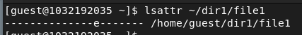

---
## Front matter
title: "Отчёт по лабораторной работе 3"
subtitle: ""
author: "Соболев Максим Сергеевич"

## Generic otions
lang: ru-RU
toc-title: "Содержание"

## Bibliography
bibliography: bib/cite.bib
csl: pandoc/csl/gost-r-7-0-5-2008-numeric.csl

## Pdf output format
toc: true # Table of contents
toc-depth: 2
lof: true # List of figures
lot: false # List of tables
fontsize: 12pt
linestretch: 1.5
papersize: a4
documentclass: scrreprt
## I18n polyglossia
polyglossia-lang:
  name: russian
  options:
	- spelling=modern
	- babelshorthands=true
polyglossia-otherlangs:
  name: english
## I18n babel
babel-lang: russian
babel-otherlangs: english
## Fonts
mainfont: PT Serif
romanfont: PT Serif
sansfont: PT Sans
monofont: PT Mono
mainfontoptions: Ligatures=TeX
romanfontoptions: Ligatures=TeX
sansfontoptions: Ligatures=TeX,Scale=MatchLowercase
monofontoptions: Scale=MatchLowercase
## Biblatex
biblatex: true
biblio-style: "gost-numeric"
biblatexoptions:
  - parentracker=true
  - backend=biber
  - hyperref=auto
  - language=auto
  - autolang=other*
  - citestyle=gost-numeric
## Pandoc-crossref LaTeX customization
figureTitle: "Рис."
tableTitle: "Таблица"
listingTitle: "Листинг"
lofTitle: "Список иллюстраций"
lotTitle: "Список таблиц"
lolTitle: "Листинги"
## Misc options
indent: true
header-includes:
  - \usepackage{indentfirst}
  - \usepackage{float} # keep figures where there are in the text
  - \usepackage{pdflscape}
  - \floatplacement{figure}{H} # keep figures where there are in the text
---

***
# Дискреционное разграничение прав в Linux. Расширенные атрибуты
 
# Цель работы

Получение практических навыков работы в консоли с расширенными
атрибутами файлов

# Задание

Научиться работать в консоли с с расширенными атрибутами файлов

# Теоретическое введение

# Выполнение лабораторной работы

## Шаг 1

От имени пользователя guest определяем расширенные атрибуты файла /home/guest/dir1/file1 командой lsattr /home/guest/dir1/file1

{ #fig:001 width=70% }

## Шаг 2

Устанавливаем командой chmod 600 file1 на файл file1 права, разрешающие чтение и запись для владельца файла

{ #fig:002 width=70% }

## Шаг 3

Устанавливаем на файл /home/guest/dir1/file1 расширенный атрибут a от имени пользователя guest: chattr +a /home/guest/dir1/file1 В ответ получаем отказ в выполнении операции.

{ #fig:003 width=70% }

## Шаг 4

Заходим в другую консоль с правами администратора. Устанавливаем расширенный атрибут a на файл /home/guest/dir1/file1 от имени суперпользователя: chattr +a /home/guest/dir1/file1

{ #fig:004 width=70% }

## Шаг 5

От пользователя guest проверяем правильность установления атрибута: lsattr /home/guest/dir1/file1

{ #fig:005 width=70% }

## Шаг 6

Выполняем дозапись в файл file1 слова «test» командой echo "test" >> /home/guest/dir1/file1
После этого выполняем чтение файла file1 командой cat /home/guest/dir1/file1
Убеждаемся, что слово test было успешно записано в file1.

{ #fig:006 width=70% }

## Шаг 7

Пробуем стереть имеющуюся в нём информацию командой echo "abcd" > /home/guest/dirl/file1 Пробуем переименовать файл. Получаем отказ в выполнении операции.

{ #fig:007 width=70% }

## Шаг 8

Пробуем с помощью команды chmod 000 file1 установить на файл file1 права, например, запрещающие чтение и запись для владельца файла.

{ #fig:008 width=70% }

## Шаг 9

Снимаем расширенный атрибут a с файла /home/guest/dirl/file1 от имени суперпользователя командой chattr -a /home/guest/dir1/file1. Повторяем операции, которые нам ранее не удавалось выполнить.

{ #fig:091 width=70% }

{ #fig:092 width=70% }

## Шаг 10

Повторяем аналогичные действия по шагам, заменив атрибут «a» атрибутом «i».
Таким образом получаем следующее: файл с аттрибутом "a" может быть только дополнен, файл с аттрибутом "i" не подлежит никаким изменениям вовсе.

{ #fig:010 width=70% }
# Выводы

В результате выполнения мы повысили навыки использования интерфейса командой строки, познакомились на примерах с тем, как используются основные и расширенные атрибуты при разграничении доступа. Имели возможность связать теорию дискреционного разделения
доступа с её реализацией на практике в ОС Linux. Составили наглядные таблицы, поясняющие какие операции возможны при тех или иных установленных правах. Опробовали действие на практике расширенных атрибутов «а» и «i».

# Список литературы{.unnumbered}

1. xattr(7) — Linux manual page // Linux man-pages project URL: https://man7.org/linux/man-pages/man7/xattr.7.html (дата обращения: 30.09.2022). 
