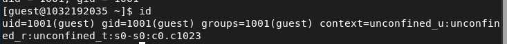

---
## Front matter
title: "Отчёт по лабораторной работе 5"
subtitle: ""
author: "Соболев Максим Сергеевич"

## Generic otions
lang: ru-RU
toc-title: "Содержание"

## Bibliography
bibliography: bib/cite.bib
csl: pandoc/csl/gost-r-7-0-5-2008-numeric.csl

## Pdf output format
toc: true # Table of contents
toc-depth: 2
lof: true # List of figures
lot: false # List of tables
fontsize: 12pt
linestretch: 1.5
papersize: a4
documentclass: scrreprt
## I18n polyglossia
polyglossia-lang:
  name: russian
  options:
	- spelling=modern
	- babelshorthands=true
polyglossia-otherlangs:
  name: english
## I18n babel
babel-lang: russian
babel-otherlangs: english
## Fonts
mainfont: PT Serif
romanfont: PT Serif
sansfont: PT Sans
monofont: PT Mono
mainfontoptions: Ligatures=TeX
romanfontoptions: Ligatures=TeX
sansfontoptions: Ligatures=TeX,Scale=MatchLowercase
monofontoptions: Scale=MatchLowercase
## Biblatex
biblatex: true
biblio-style: "gost-numeric"
biblatexoptions:
  - parentracker=true
  - backend=biber
  - hyperref=auto
  - language=auto
  - autolang=other*
  - citestyle=gost-numeric
## Pandoc-crossref LaTeX customization
figureTitle: "Рис."
tableTitle: "Таблица"
listingTitle: "Листинг"
lofTitle: "Список иллюстраций"
lotTitle: "Список таблиц"
lolTitle: "Листинги"
## Misc options
indent: true
header-includes:
  - \usepackage{indentfirst}
  - \usepackage{float} # keep figures where there are in the text
  - \usepackage{pdflscape}
  - \floatplacement{figure}{H} # keep figures where there are in the text
---

***
# Дискреционное разграничение прав в Linux. Исследование влияния дополнительных атрибутов
 
# Цель работы

Изучение механизмов изменения идентификаторов, применения SetUID- и Sticky-битов. Получение практических навыков работы в консоли с дополнительными атрибутами. Рассмотрение работы механизма смены идентификатора процессов пользователей, а также влияние бита Sticky на запись и удаление файлов.

# Задание

Исследовать влияние дополнительных атрибутов
Исследовать Sticky-бит

# Теоретическое введение

В Linux существует три основных вида прав — право на чтение, запись и выполнение, а также три категории пользователей, к которым они могут применяться — владелец файла, группа владельца и все остальные.
***
# Выполнение лабораторной работы часть 1

## Шаг 1

Входим в систему от имени пользователя guest.

{ #fig:001 width=70% }

## Шаг 2

Создаем программу

{ #fig:002 width=70% }

## Шаг 3

Комплилируем программу и убеждаемся, что файл программы создан: gcc simpleid.c -o simpleid

{ #fig:003 width=70% }

## Шаг 4

Выполняем программу simpleid:./simpleid

{ #fig:004 width=70% }
## Шаг 5

Выполняем системную программу id: id и сравниваем полученный результат с данными предыдущего пункта задания.

{ #fig:005 width=70% }

## Шаг 6

Усложняем программу, добавив вывод действительных идентификаторов

{ #fig:006 width=70% }

Получившуюся программу называем simpleid2.c.

## Шаг 7

Компилируем и запускаем simpleid2.c: gcc simpleid2.c -o simpleid2 
./simpleid2

{ #fig:007 width=70% }

## Шаг 8

От имени суперпользователя выполняем команды:
chown root:guest /home/guest/simpleid2
chmod u+s /home/guest/simpleid2

{ #fig:008 width=70% }

## Шаг 9

Выполняем проверку правильности установки новых атрибутов и смены владельца файла simpleid2: ls -l simpleid2

{ #fig:010 width=70% }

## Шаг 10

Запускаем simpleid2 и id:./simpleid2 id и сравниваем результаты

{ #fig:011 width=70% }

## Шаг 11

Проделываем тоже самое относительно SetGID-бита

{ #fig:012.1 width=70% }

{ #fig:012.2 width=70% }

## Шаг 12

Создаем программу readfile.c:

{ #fig:013 width=70% }

## Шаг 13

Компилируем её.
gcc readfile.c -o readfile

{ #fig:014 width=70% }

## Шаг 14

Сменяем владельца у файла readfile.c и изменяем права так, чтобы только суперпользователь мог прочитать его, a guest не мог

{ #fig:015 width=70% }

## Шаг 15

Проверяем, что пользователь guest не может прочитать файл readfile.c.

{ #fig:016 width=70% }

Получившуюся программу называем simpleid2.c.

## Шаг 16

Меняем у программы readfile владельца и устанавливаем SetU’D-бит.

{ #fig:017 width=70% }

## Шаг 17

Проверяем, может ли программа readfile прочитать файл readfile.c?

{ #fig:018 width=70% }

Чтение файла невозможно, программа выдаёт segfault при попытке чтения файлов

## Шаг 18

Проверяем, может ли программа readfile прочитать файл /etc/shadow?

{ #fig:019 width=70% }

Чтение файла невозможно, программа выдаёт segfault при попытке чтения файлов.
При этом попытка чтения файла без атрибута +s, принадлежащего пользователю guest происходит без проблем 
***
# Выполнение лабораторной работы часть 2

## Шаг 1

Выясняем, установлен ли атрибут Sticky на директории /tmp, для чего выполняем команду
ls -l / | grep tmp

{ #fig:02.1 width=70% }

## Шаг 2

От имени пользователя guest создаем файл file01.txt в директории /tmp
со словом test:
echo "test" > /tmp/file01.txt

{ #fig:02.2 width=70% }

## Шаг 3

Просматриваем атрибуты у только что созданного файла и разрешаем чтение и запись для категории пользователей «все остальные»:
ls -l /tmp/file01.txt
chmod o+rw /tmp/file01.txt
ls -l /tmp/file01.txt

{ #fig:02.3 width=70% }

## Шаг 4

От пользователя guest2 попробуем прочитать файл /tmp/file01.txt:
cat /tmp/file01.txt

{ #fig:02.4 width=70% }
## Шаг 5

От пользователя guest2 попробуем дозаписать в файл
/tmp/file01.txt слово test2 командой echo "test2" > /tmp/file01.txt

{ #fig:02.5 width=70% }

## Шаг 6

Проверьте содержимое файла командой
cat /tmp/file01.txt

{ #fig:02.6 width=70% }

## Шаг 7

От пользователя guest2 попробуем записать в файл /tmp/file01.txt
слово test3, стерев при этом всю имеющуюся в файле информацию командой
echo "test3" > /tmp/file01.txt

{ #fig:02.7 width=70% }

## Шаг 8

Проверяем содержимое файла командой
cat /tmp/file01.txt

{ #fig:02.8 width=70% }

## Шаг 9

От пользователя guest2 попробуем удалить файл /tmp/file01.txt командой
rm /tmp/fileOl.txt

{ #fig:02.9 width=70% }

## Шаг 10

Повышаем свои права до суперпользователя следующей командой su -
и выполняем после этого команду, снимающую атрибут t (Sticky-бит) с директории /tmp: chmod -t /tmp

{ #fig:02.10 width=70% }

## Шаг 11

Покидаем режим суперпользователя командой exit

{ #fig:02.11 width=70% }

## Шаг 12

От пользователя guest2 проверяем, что атрибуты t у директории /tmp нет:
ls -l / | grep tmp

{ #fig:02.12 width=70% }

## Шаг 13

Запись и дозапись работают без изменений, удаление файла стало доступно

{ #fig:02.13 width=70% }

## Шаг 14

Да удалось

## Шаг 15

Повышаем свои права до суперпользователя и возвращаем атрибут t на директорию /tmp:
su -
chmod +t /tmp
exit

{ #fig:02.15 width=70% }

# Выводы

Мы изучили механизмы изменения идентификаторов, применение
SetUID- и Sticky-битов. Получили практические навыки работы в консоли с дополнительными атрибутами. Рассмотрели работу механизма
смены идентификатора процессов пользователей, а также влияние бита
Sticky на запись и удаление файлов.

# Список литературы{.unnumbered}

1. xattr(7) — Linux manual page // Linux man-pages project URL: https://man7.org/linux/man-pages/man7/xattr.7.html (дата обращения: 30.09.2022). 
