---
## Front matter
lang: ru-RU
title: Мандатное разграничение прав в Linux
subtitle:
author:
  - Соболев М. С.
institute:
  - Российский университет дружбы народов, Москва, Россия
date: 15 октября 2022

## i18n babel
babel-lang: russian
babel-otherlangs: english

## Formatting pdf
toc: false
toc-title: Содержание
slide_level: 2
aspectratio: 169
section-titles: true
theme: metropolis
header-includes:
 - \metroset{progressbar=frametitle,sectionpage=progressbar,numbering=fraction}
 - '\makeatletter'
 - '\beamer@ignorenonframefalse'
 - '\makeatother'

## Fonts
mainfont: PT Serif
romanfont: PT Serif
sansfont: PT Sans
monofont: PT Mono
mainfontoptions: Ligatures=TeX
romanfontoptions: Ligatures=TeX
sansfontoptions: Ligatures=TeX,Scale=MatchLowercase
monofontoptions: Scale=MatchLowercase

---

# Информация

## Докладчик

:::::::::::::: {.columns align=center}
::: {.column width="70%"}

  * Соболев Максим Сергеевич
  * Студент 4 курса, 1032192035
  * Направление: Бизнес-информатика
  * Российский университет дружбы народов
  * [sobolek322lorek@gmail.com](sobolek322lorek@gmail.com)

:::
::: {.column width="30%"}

:::
::::::::::::::

# Вводная часть

## Актуальность

- Изучим SELinx

## Объект и предмет исследования

- Изучение работы SELinx на практике совместно с веб-сервером Apache.

## Цель

- Получение практических навыков работы с SELinx

## Материал

- Отчет по ранее выполненной работе

# Выполнение лабораторной работы

##  1

Входим в систему с полученными учётными данными и убеждаемся, что
SELinux работает в режиме enforcing политики targeted с помощью команд getenforce и sestatus

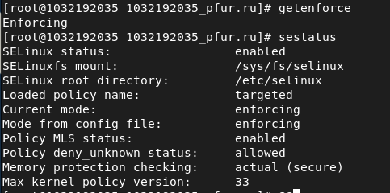{ #fig:001 width=70% }

##  2

Проверяем, что apache работает: systemctl status httpd

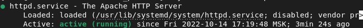{ #fig:002 width=70% }

##  3

Найдем веб-сервер Apache в списке процессов, определим его контекст
безопасности.

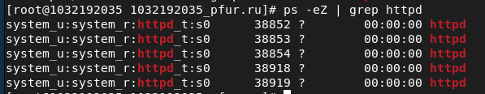{ #fig:003 width=70% }

##  4

Посмотрим текущее состояние переключателей SELinux для Apache с помощью команды
sestatus -bigrep httpd

Обратим внимание, что многие из них находятся в положении «off».

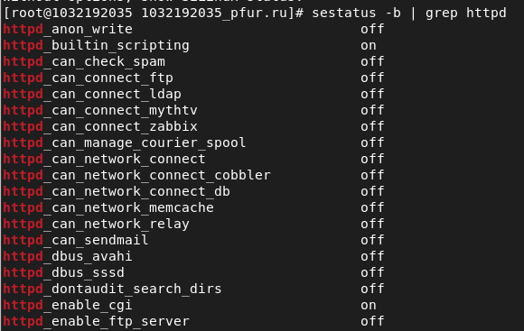{ #fig:004 width=70% }

##  5

Посмотрим статистику по политике с помощью команды seinfo, также определите множество пользователей, ролей, типов.

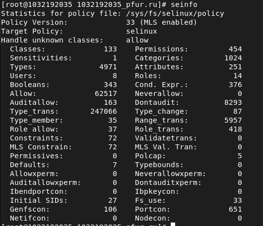{ #fig:005 width=70% }

##  6

Определим тип файлов и поддиректорий, находящихся в директории /var/www/, с помощью команды ls -lZ /var/www/

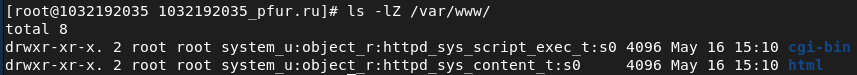{ #fig:006 width=70% }

##  7

Определим тип файлов, находящихся в директории /var/www/html/: ls -lZ /var/www/html/

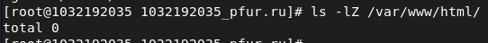{ #fig:007 width=70% }

Файлов нет

##  8

Определим круг пользователей, которым разрешено создание файлов в директории /var/www/html/.

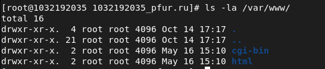{ #fig:008 width=70% }

Создание файлов разрешено только пользователю root

##  9

Создадим от имени суперпользователя html-файл /var/www/html/test.html следующего содержания:
<html>
<body>test</body>
</html>

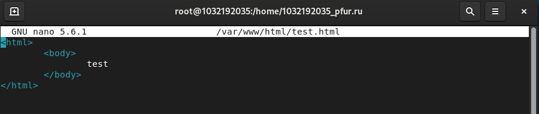{ #fig:009 width=70% }

##  10

Проверим контекст созданного нами файла.

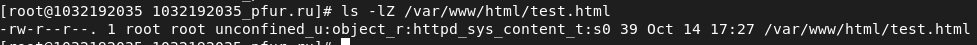{ #fig:010 width=70% }

##  11

Обращаемся к файлу через веб-сервер, введя в браузере адрес
http://localhost/test.html. Убеждаемся, что файл был успешно отображён.

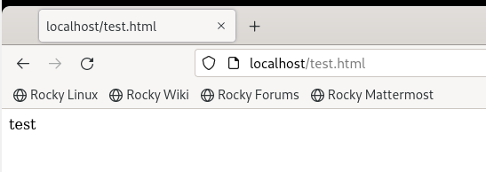{ #fig:011 width=70% }

##  12

Изучим справку man httpd_selinux и выясним, какие контексты файлов определены для httpd.

Изучили.

##  13

Изменяем контекст файла /var/www/html/test.html с httpd_sys_content_t на samba_share_t, к которому процесс httpd не должен иметь доступа:
chcon -t samba_share_t /var/www/html/test.html ls -Z /var/www/html/test.html

После этого проверяем, что контекст поменялся.

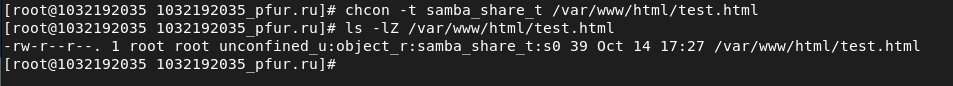{ #fig:013 width=70% }

##  14

Попробуем ещё раз получить доступ к файлу через веб-сервер, введя в браузере адрес http://localhost/test.html. Получаем сообщение об ошибке: 
Forbidden
You don't have permission to access /test.html on this server.

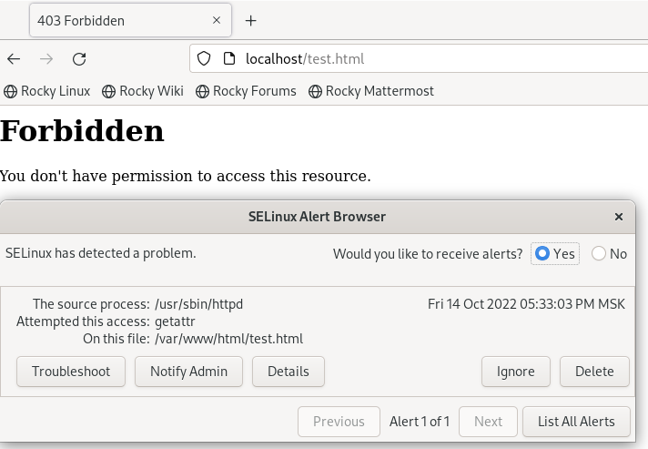{ #fig:014 width=70% }

##  15

Файл не отображён, поскольку процесс httpd не имеет доступа к файлам с заданным процессом. SELinux не выдаёт мандат на чтение, таким образом запрещая чтение файла

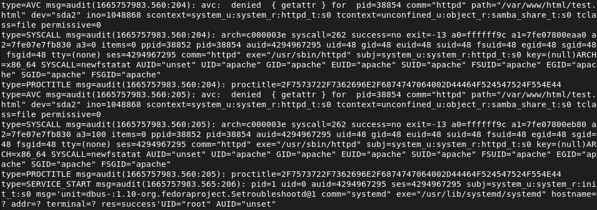{ #fig:015 width=70% }

##  16

Пробуем запустить веб-сервер Apache на прослушивание ТСР-порта 81.

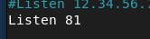{ #fig:016 width=70% }

##  17

Выполните перезапуск веб-сервера Apache. Произошёл сбой? Почему?
Нет, не произошёл. Новые версии политик selinux позволяют httpd работать на разных портах, в т.ч. 81. 
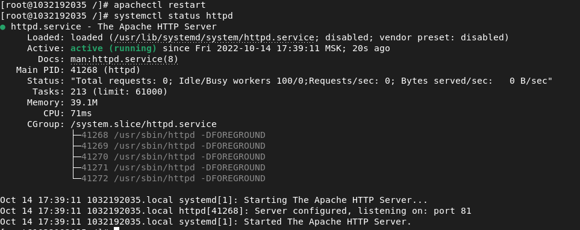{ #fig:017 width=70% }

##  18

Поменяем в конфиге порт на тот, который действительно не находится в списке разрешённых (8874), попробуем перезапустить httpd, получим ошибку, изучим логи.

##  19

Выполним команду
semanage port -a -t http_port_t -р tcp 8874
После этого проверим список портов командой
semanage port -l | grep http_port_t
Убеждаемся, что порт 8874 появился в списке.

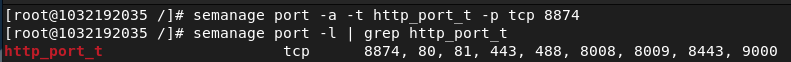{ #fig:019 width=70% }

##  20

Да, поняли. Политика selinux не позволяла процессу прослушивать порт

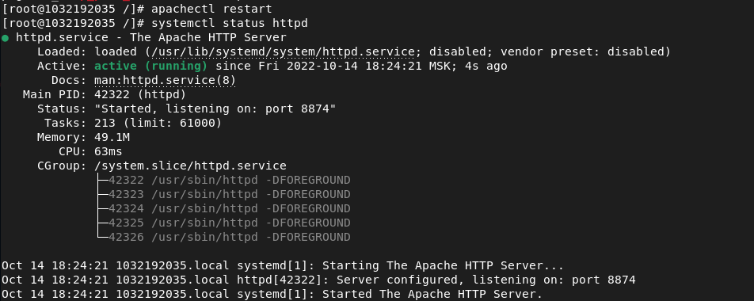{ #fig:020 width=70% }

##  21

Вернем контекст httpd_sys_cоntent__t к файлу /var/www/html/ test.html:
chcon -t httpd_sys_content_t /var/www/html/test.html
После этого попробуем получить доступ к файлу через веб-сервер, введя в браузере адрес http://localhost:8874/test.html.
Мы должны увидеть содержимое файла — слово «test».

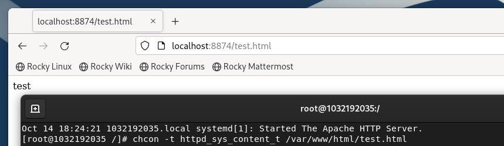{ #fig:021 width=70% }

##  22

Исправим обратно конфигурационный файл apache, вернув Listen 80

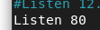{ #fig:022 width=70% }

##  23

Удалим привязку http_port_t к 8874 порту:
semanage port -d -t http_port_t -p tcp 8874
и проверим, что порт 8874 удалён

{ #fig:023 width=70% }

##  24

Удалим файл /var/www/html/test.html:
rm /var/www/html/test.html

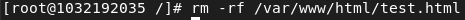{ #fig:024 width=70% }

# Выводы

Мы развили навыки администрирования ОС Linux. Получили первое практическое знакомство с технологией SELinux

Проверили работу SELinx на практике совместно с веб-сервером Apache

:::

